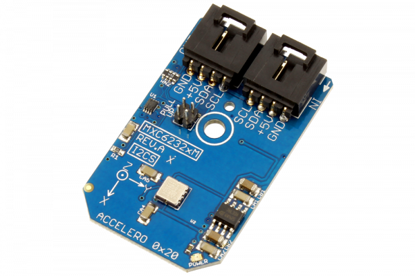

# MXC6232xM

The MEMSIC Digital Thermal Orientation Sensor (DTOS) is the world’s first fully-integrated orientation sensor.
This Device is available from www.ncd.io 

[SKU: MXC6232xM_I2CS]

(https://store.ncd.io/product/mxc6232xm-low-power-%C2%B12g-dual-axis-accelerometer-i2c-mini-module/)
This Sample code can be used with Arduino.

Hardware needed to interface MXC6232xM sensor with Arduino

1. <a href="https://store.ncd.io/product/i2c-shield-for-arduino-nano/">Arduino Nano</a>

2. <a href="https://store.ncd.io/product/i2c-shield-for-arduino-micro-with-i2c-expansion-port/">Arduino Micro</a>

3. <a href="https://store.ncd.io/product/i2c-shield-for-arduino-uno/">Arduino uno</a>

4. <a href="https://store.ncd.io/product/dual-i2c-shield-for-arduino-due-with-modular-communications-interface/">Arduino Due</a>

5. <a href="https://store.ncd.io/product/mxc6232xm-low-power-%C2%B12g-dual-axis-accelerometer-i2c-mini-module/">MXC6232xM 2Axis Accelometer Sensor</a>

6. <a href="https://store.ncd.io/product/i%C2%B2c-cable/">I2C Cable</a>

MXC6232xM:

The MEMSIC Digital Thermal Orientation Sensor (DTOS) is the world’s first fully-integrated orientation sensor.

Applications:

• Information Appliances – Cell Phones, PDA’s, Computer Peripherals

• Consumer – LCD Projectors, Pedometers, Blood PressureMonitor, Digital Cameras

• Gaming – Joystick/RF Interface/Menu Selection/TiltSensing

• GPS -Electronic Compass Tilt Correction, DeadReckoning Assist

How to Use the MXC6232xM Arduino Library

The MXC6232xM has a number of settings, which can be configured based on user requirements.
          
1.Address calling:The following command is used to call the MXC6232xM sensor to begin the transmission.

             mxc.getAddr_MXC6232xM(MXC6232xM_DEFAULT_ADDRESS_ACCEL);        // 0x10
            
2.Sensor setup:The following command is used to setup the sensor.

             mxc.setUpAccelerometer();
             
3.Output measurement:The following command is used to measure the output of MXC6232xM sensor.             
             
             mxc.Measure_Accelerometer();

